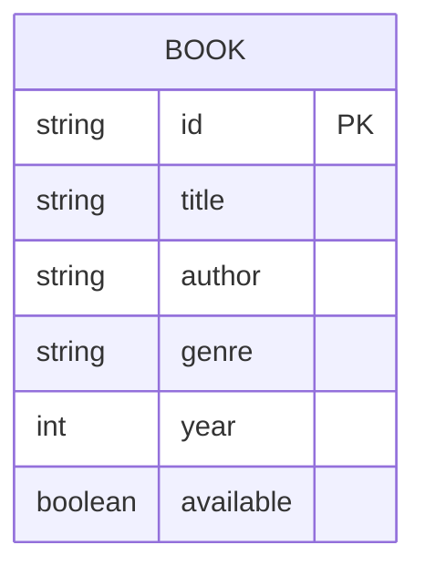

# Domain Model

The catalogue is a single entity: a Book, seeded once in memory by library-service and never written to by the product.

- **Book** — one of the \~15 seed titles in the team library. `available` reflects whether the physical copy is currently on the shelf; nothing in this product ever changes it.

