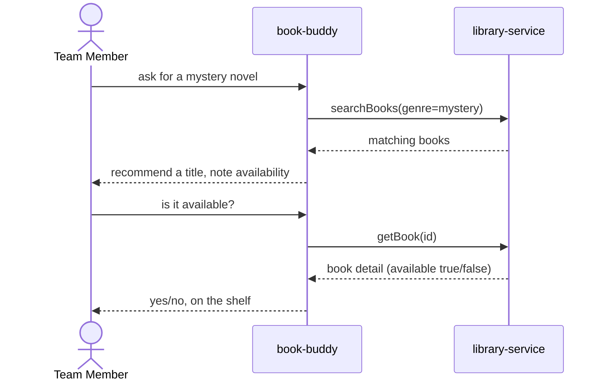

# Finding a book

A Team Member chats with book-buddy to get a recommendation and check whether a title is on the shelf.

```mermaid
sequenceDiagram
    actor TeamMember as Team Member
    participant book-buddy
    participant library-service

    TeamMember->>book-buddy: ask for a mystery novel
    book-buddy->>library-service: searchBooks(genre=mystery)
    library-service-->>book-buddy: matching books
    book-buddy-->>TeamMember: recommend a title, note availability
    TeamMember->>book-buddy: is it available?
    book-buddy->>library-service: getBook(id)
    library-service-->>book-buddy: book detail (available true/false)
    book-buddy-->>TeamMember: yes/no, on the shelf
```

